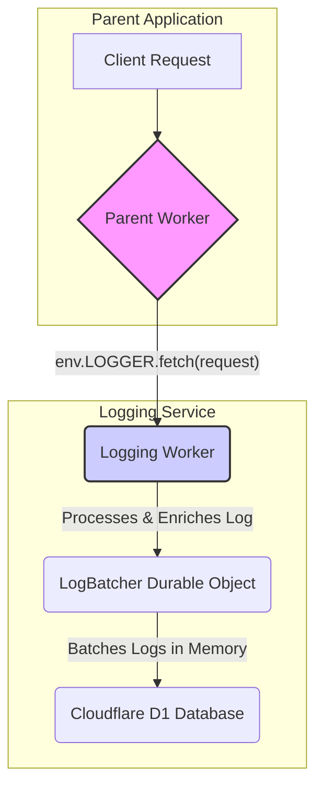

# Divortio D1 Logger for Cloudflare Workers

A production-grade, high-performance logging service for the Cloudflare ecosystem. It provides a "fire-and-forget"
logging solution that captures rich request data and persists it to a Cloudflare D1 database with zero performance
impact on your user-facing applications.

---

### Key Features

* **🚀 High-Performance**: Asynchronous, non-blocking architecture ensures zero latency is added to your application's
  response times.
* **💾 Efficient Batching**: Uses sharded Durable Objects to batch logs in memory, dramatically reducing database writes
  and improving throughput.
* **🛡️ Production-Ready**: Includes a dead-letter queue for failed batches, graceful shutdown, and robust error
  handling.
* **⚙️ Automated Schema Management**: Automatically creates and migrates database tables, allowing for seamless schema
  updates.
* **📊 Rich Data & Observability**: Captures over 50 data points per request and sends detailed operational metrics to
  the Workers Analytics Engine.
* **🔀 Powerful Routing & Filtering**: Create custom logging pipelines to separate logs into different tables with
  unique schemas and retention policies.

---

### Architecture Overview

The logger uses a simple but powerful "fire-and-forget" pipeline. A parent worker forwards its request to the logging
service, which processes it asynchronously and sends it to a sharded Durable Object for batching and persistence.

<details>
<summary><b>Click to view Architectural Diagram</b></summary>



</details>

---

### Quick Start Guide

1. **Setup Cloudflare Resources**:
    * Create a **D1 Database** for storing logs.
    * Create two **KV Namespaces**: `LOGDO_STATE` and `LOGDO_DEAD_LETTER`.
    * For a detailed guide, see the [**Setup and Deployment Documentation**](./docs/2-setup-and-deployment.md).

2. **Configure `wrangler.toml`**:
    * Update your `wrangler.toml` file with the IDs from the resources you just created.

3. **Deploy**:
    * Run `npx wrangler deploy` from your terminal.

4. **Usage in a Parent Worker**:
    * Add a service binding to your parent worker's `wrangler.toml`:
        ```toml
        [[services]]
        binding = "LOGGER"
        service = "divortio-logdo"
        ```
    * Log requests from your parent worker's code:
        ```javascript
        export default {
          async fetch(request, env, ctx) {
            // Forward the request to the logger and continue without waiting
            ctx.waitUntil(env.LOGGER.fetch(request));

            // ... your worker's main logic
            return new Response("OK");
          }
        };
        ```

---

### Data Schema

The logger captures over 50 data points for every request, providing deep insight into your traffic.

<details>
<summary><b>Click to view the full Data Schema</b></summary>

| Name                   | Type      | Indexed | Description                                                                    |
| :--------------------- | :-------- | :------ | :----------------------------------------------------------------------------- |
| **logId** | `TEXT`    | No      | A unique, time-sortable Push ID generated for each log entry. Primary Key. |
| **rayId** | `TEXT`    | Yes     | The `cf-ray` header, unique to every request that goes through Cloudflare.   |
| **fpID** | `TEXT`    | Yes     | A client-side generated fingerprint ID, often sourced from a cookie.         |
| **
deviceHash** | `TEXT`    | No      | A hash of the User-Agent and TLS signature to identify the device type.        |
| **
connectionHash** | `TEXT`    | Yes     | A hash of the IP, User-Agent, and TLS signature to identify a user session.  |
| **tlsHash** | `TEXT`    | No      | A hash of the JA3, cipher, and other TLS data to fingerprint the connection. |
| **requestTime** | `INTEGER` | No      | A Unix timestamp (in milliseconds) of when the log processing started.       |
| **
receivedAt** | `DATETIME`| Yes     | An ISO 8601 timestamp of when the log processing started.                      |
| **processedAt** | `DATETIME`| No      | An ISO 8601 timestamp of when the log object was fully assembled.            |
| **... (and 40+ more
fields)** |           |         |                                                                                |

*For the complete list of all 50+ fields, please see the [**Data Schema Documentation**](./docs/3-data-schema.md).*

</details>

---

### Full Documentation

For detailed information on all features, including advanced configuration, observability, and the dead-letter queue,
please see the full documentation in the **[`/docs`](./docs)** directory.